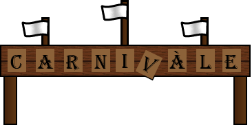
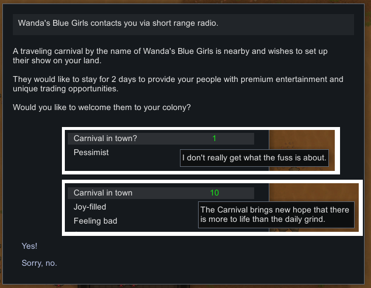

## A tentative alpha is ready.
Major features are implemented, but further testing is needed before a full release.
Requires [XnopeCore](https://github.com/Xnope/XnopeCore)

# CARNIVÀLE
My first content mod for Rimworld. Adds a new unique faction type: carnivals. My goal for this mod is for the end product to fit very nicely in the space-cowboy / wild-west aesthetic of vanilla RimWorld. It was inspired by the long-cancelled HBO show by the same name.

The shear variety of content this mod seeks to add (and partially already has added) to the vanilla game makes it one of the most expansive kinds of mods out there. Feel free to peruse the source if you want to see how this or that is accomplished; I make this available entirely because of how grateful I am to other modders who have made their mods open-source and thus allowed me to learn from their examples.

# Feature dump, both Planned and Done:
* Extended from XnopeCore:
  * New roaming faction (no settlements generated) type: Carnivals [DONE]
  * MANY new backstories reflecting carny lifestyles [DONE]
  * Dynamic faction naming: Carnivals' names often reflect their leaders', and update upon change of leadership [DONE]
* Complex, but still fairly efficient AI behaviour
  * Highly specific and versatile placement logic for buildings etcetera [DONE, ongoing]
  * Construction of carnival buildings [DONE]
  * Cutting of plants where buildings should go [DONE]
  * Hauling of things either to carriers or to a trash zone that is up for colonist grabs [DONE]
  * Manning of positions at the approriate times [ongoing]
    * vendor positions (there are up to three different kinds of trader at a time!) [DONE]
    * guard positions [DONEish]
    * announcers / ticket (silver) takers [partially done]
    * game masters [started]
  * Meandering, socialising, getting joy, eating, sleeping, etc [DONE]
* New buildings
  * Tents: lodging tents for carnies to sleep [DONE], chapiteau tent [DONE], kitchen tents?
    * YES! BUILDINGS YOU CAN GO INSIDE OF!
  * Stalls: vendor stalls [DONE], game stalls [one is done]
  * "CARNIVALE" Entrance Banner [DONE]
  * A trash sign designating items that are unwanted by the carnies and are up for grabs. This is great because carnies may cut plants that you've been wanting to cut for a while, but they won't (usually) steal the resources. [DONE]
* New apparel, and maybe a few new weapons (baseball bats, anyone?)
* New incidents
  * Carnivals request to visit your colony one day prior [DONE]
  * Upon arrival, carnies will set up their buildings and prepare [DONEish, ongoing]. Then, they will either put on a show immediately, or rest until the next day if it took them a while to set up. They will cycle between entertaining and resting until they leave (usually only a couple of days total).
  * Other passing factions may visit to experience the carnival!
  * Fireball shows... not gonna explain
  * "Carnival Justice": how'd you get a band of goofballs to hate you so much?
* A boatload of new backstories [DONE, ongoing]
* New stat: luckiness [partially done]
  * affects chance to win carnival games, perhaps more things like surgery success chance / dodge chance
* New traits [DONE]:
  * Narcissist - designed to go with spoiled prodigies. Increased social fight chance, global learn speed, mental break threshold.
  * Sweet Talker - (rare) increased social chat impact, gift impact, recruit prisoner chance, decreased social fight chance (todo: balance more)
  * Luckiness
    * Lucky - slightly better at most random rolls, including carnival game win chances
    * Unlucky - ...quite the opposite.
  * A secret, rare trait that only one pawn in the game can have, with a devastating yet unique mechanic... look for this pawn amongst carnies.
* And absolutely (eventually), the ability for players to run their own carnival caravans

## Texture artists welcomed!
I'm a bit stronger on the coding side of things than the texturing side, so if you have a desire to help the mod along by drawing up textures of anything you think works with *Carnivale*'s goals, please do and contact me.

## Some example textures

# Screenies

